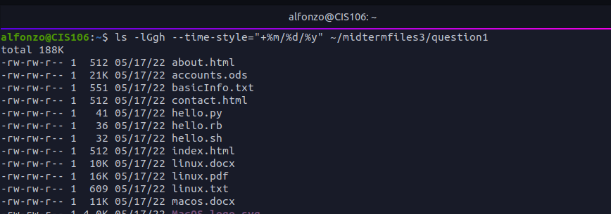
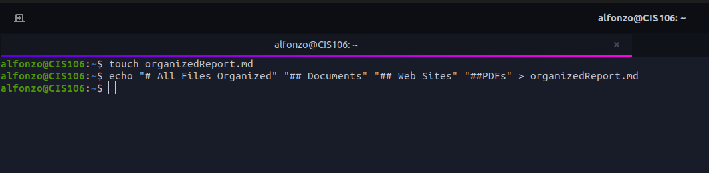
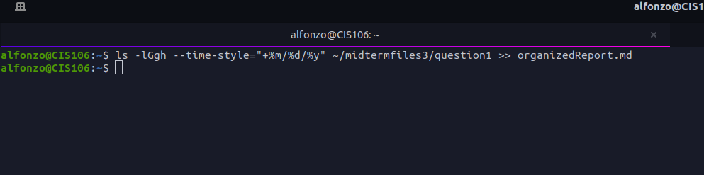
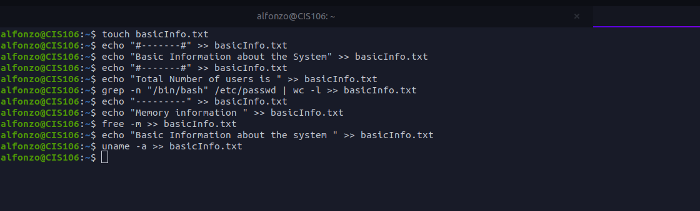
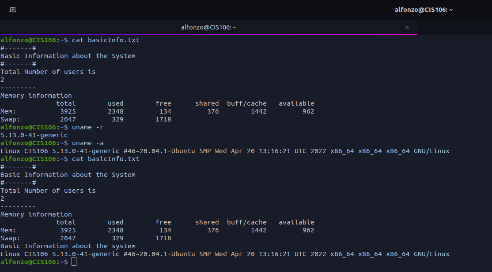
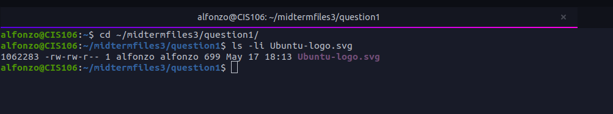
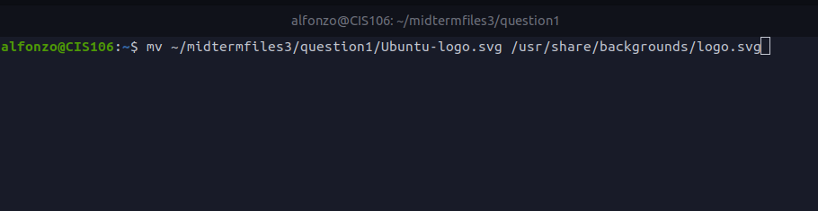
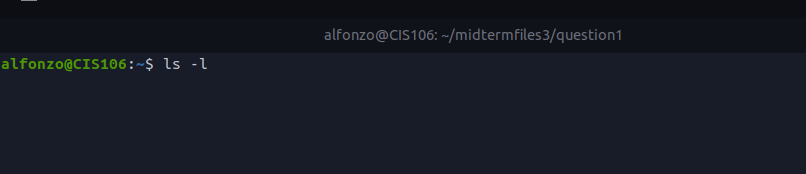
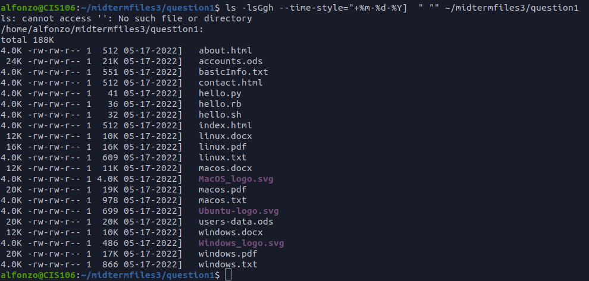

 # Final Exam Submission

 ## Q1
 
 
 
 ## Q2

 ## Q3

 ## Q4
1. What is the Absolute path of the image you picked?
   `~/midtermfiles3/question1/Ubuntu-logo.svg`
1. What is the inode number of the image you picked?
   

2. 

3. 

4. 