## What is Virtualization?

Virtualization is a type of computer technology that replicates actual hardware capabilities in order to construct software-based IT services such as applications, servers, storage, and networks.
Virtualization allows businesses to cut hardware expenses and boost productivity by producing a virtual version of a resource or device (such as a desktop computer) from a single computer system. 

## VirtualBox

VirtualBox is a robust x86 and AMD64/Intel64 virtualization tool that can be used in both the workplace and at home. VirtualBox is not only a feature-rich, high-performance product for corporate clients, but it is also the only professional solution that is freely accessible as Open Source Software.

### How to install VirtualBox in Windows 10.

1. Download the installer from this link [Virtualbox](https://download.virtualbox.org/virtualbox/6.1.32/VirtualBox-6.1.32-149290-Win.exe).
2. Start Installer.
3. Once Installer is done, Install extension path from this link [ExtesionPath](https://download.virtualbox.org/virtualbox/6.1.32/Oracle_VM_VirtualBox_Extension_Pack-6.1.32.vbox-extpack)

### How to create a Virtual Machine

1. open VirtualBox
2. click on "New" 
3. Fill out form
**Name:** Ubuntu (it can be any name you want)
**Machine Folder:** Here you can choose the driver where you want to install the virtual machine 
**Type:** Linux
**Version:** Ubuntu 64-bit

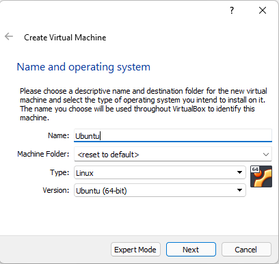

4. **Allocate a Minimum of “2048” MB of Memory (equal to 2 GiB)**

5. Use “Create a virtual hard disk now” for the Hard disk
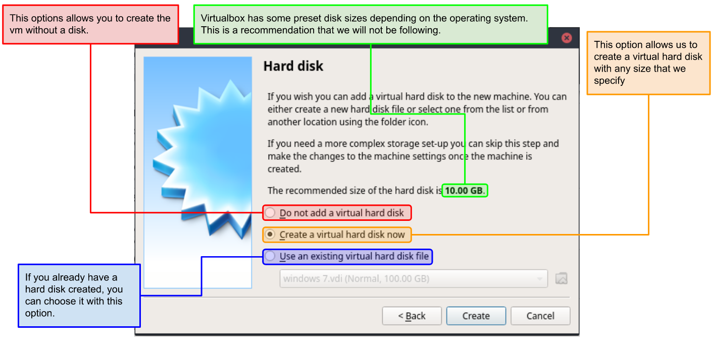

6. Use “VDI” to create a virtual hard disk
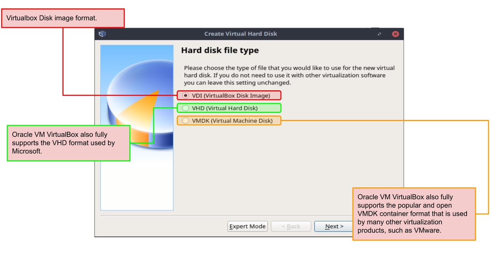

7. Choose “Dynamically allocated”
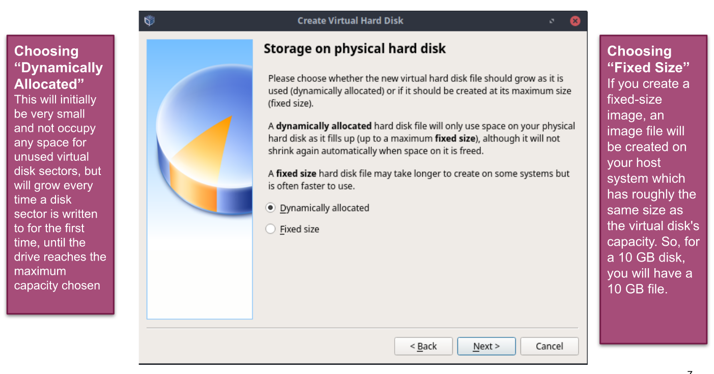

8. **Allocate at Minimum 25 GB (recommended 50 or more)**
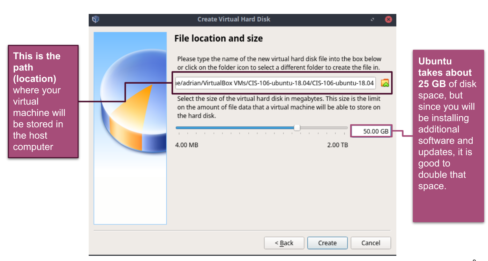

9. Click **Create** button and VirtualBox will generate Ubuntu virtual machine.
  

10.  **Note** that if you have not downloaded 64-bit Ubuntu ISO file, you can download from the publisher page [ubuntu](https://ubuntu.com/) or use this link to download automatically [ubuntuiso](https://ubuntu.com/download/desktop/thank-you?version=20.04.4&architecture=amd64). When downloading Ubuntu ISO file, make sure to select 64-bit version. Also make sure the <mark>VT-x/Virtualization Technology has been enabled in your computer's BIOS/Basic Input Output System. In order to access BIOS on a Windows PC, you must press your BIOS key set by your manufacturer which could be F10, F2, F12, F1, or DEL.</mark> 
     
 

11.Choose  your ubuntu setting,details,storage,controller:IDE and the location where you download your iso and click ok  

## Installing Ubuntu in Virtualbox

1. Back to Oracle VM VirtualBox Manager, click on the new Ubuntu virtual machine and hit 'Start' button. Now you shall see a 'Welcome' screen. Click 'Install Ubuntu' button. 
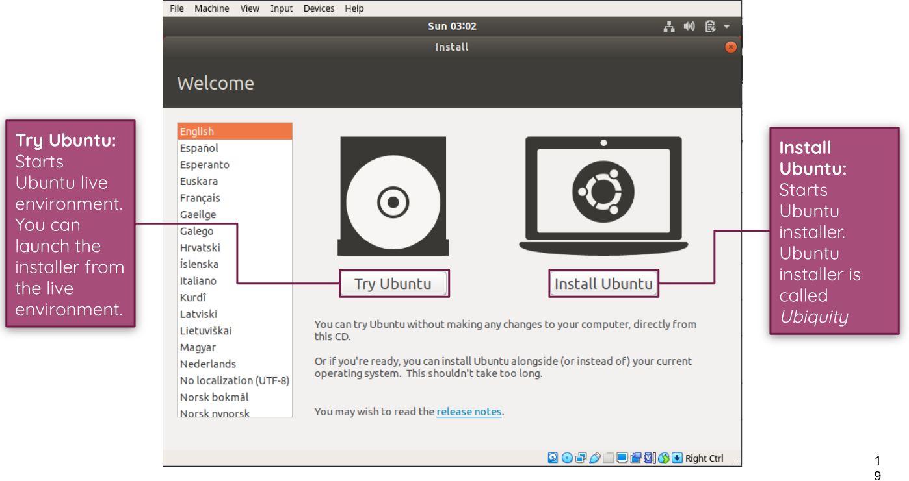

2.Choose your Keyboard layout
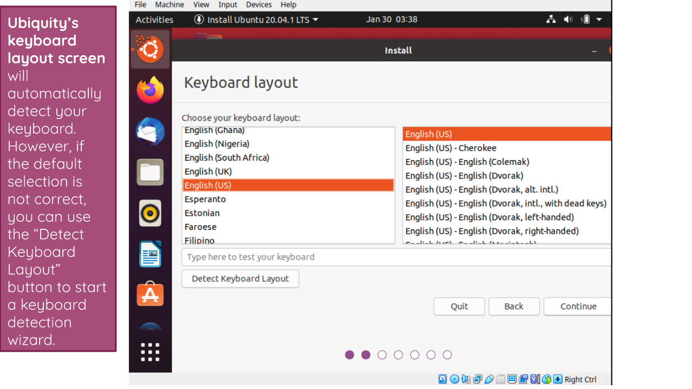

3. Choose Normal install/check both box on other option.
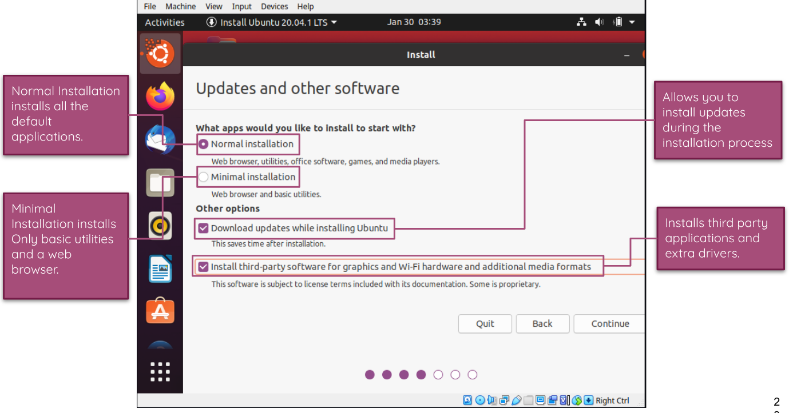

4. Choose your  time zone.

5. In 'Who are you?' dialog, enter your preferred name, username and password. <mark>Note that this user will have root/sudo privilege. Click 'Continue' button</mark>.
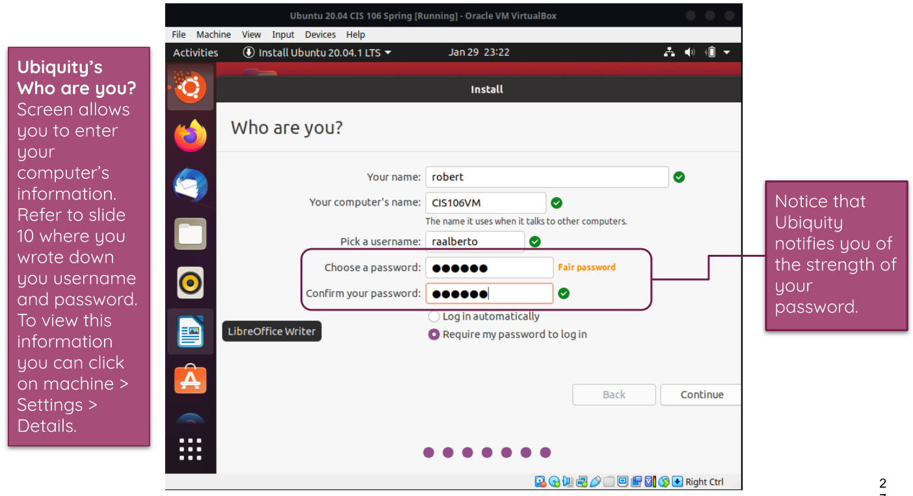

6.The installation will continue until it is finished. 
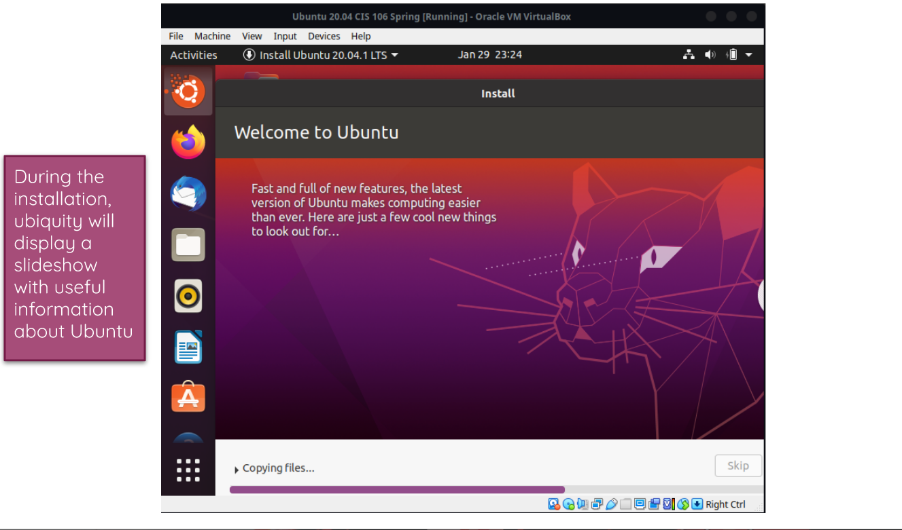

### Updating Ubuntu
1. To update ubuntu first you need to open your terminal by pressing ctrl + alt+ t .This will launch the terminal or you can search on the show application button. Next enter the command `sudo apt update; sudo apt upgrade -y` this command will update the whole ubuntu ios and apps.
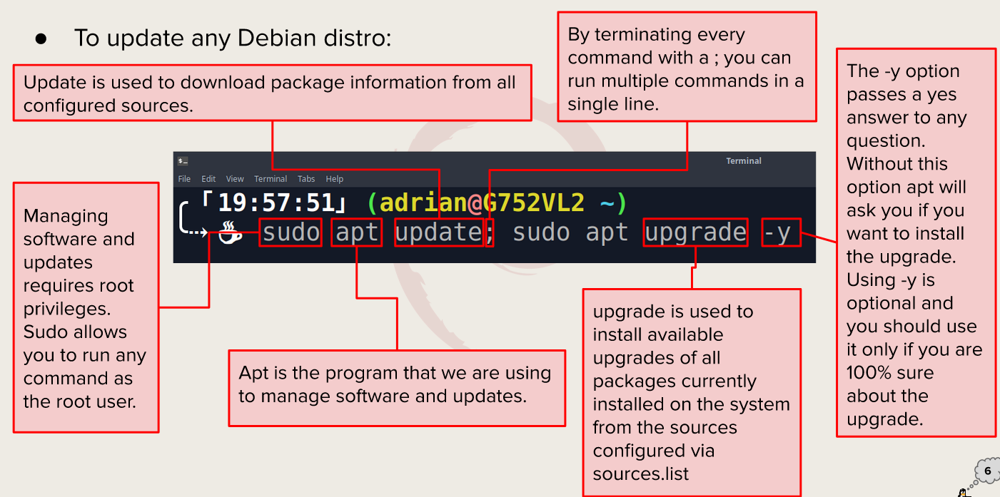

### Installing Software in Ubuntu

+ installation command Example
  + `sudo + apt + install + name of package`
+ for example:
  + `sudo apt install airstrike` this will install 2d game call airstrike.
   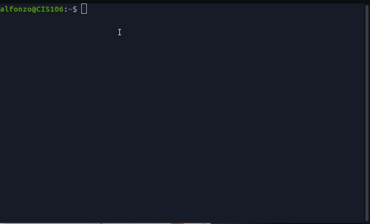 
+ Searching for Software.
  + `apt search "games"` this command will look for available games to install.
+ Deleting Software
  + `sudo + apt + remove + name of package`
    for example :
    + `sudo apt remove airstrike -y` this would remove the game airstrike will previously download.        

## Basic Linux Command

### Navigating the file system

#### pwd
* Description : used for displaying your current working directory
* usage: `pwd`
* Example:
  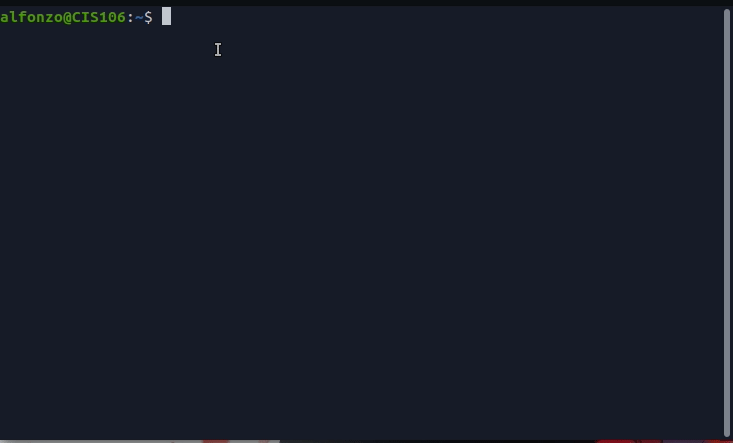

#### cd
* Description : Use to change current working directory
* usage: `cd + Destination`
* Example : move from Home directory to Downloads folder.
* `cd Downloads`
  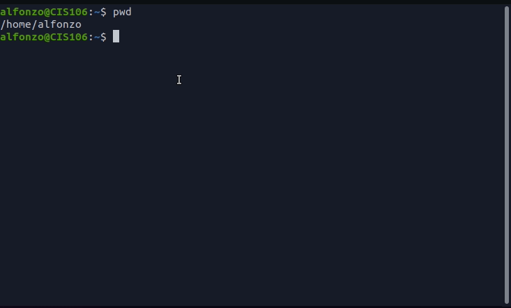

#### ls

* Description: used to display all files inside a give directory.
* usage : `ls + file/directory`
* Example: this will show all the files in the folder Downloads.
* `ls /Downloads`.
* 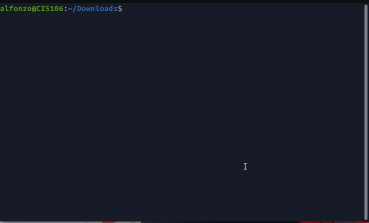

### Managin files and directories

+ #### mkdir 
  * Description: use for creating directories
  * usage: `mkdir + option + new directory path`
  * Example:
    * Create a directory in the present working directory.
    * `mkdir Wallpaper/`
    * Create a parent directory and child directory.
    * `mkdir Wallpaper/cars/new` 
  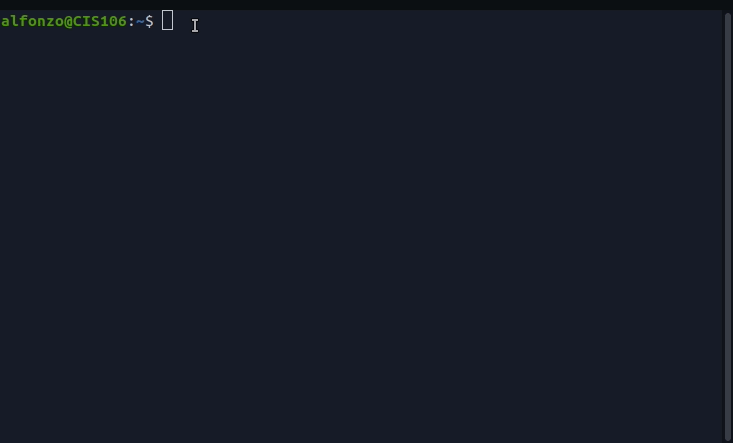

  #### touch

  * Description : use to create files.
  * usage : `touch + file name `.
  * Example:
  * Create a file in the Wallpaper/cars/new/ directory.
  * `touch Wallpaper/cars/new/BMW.png ` this will create a image png file.
  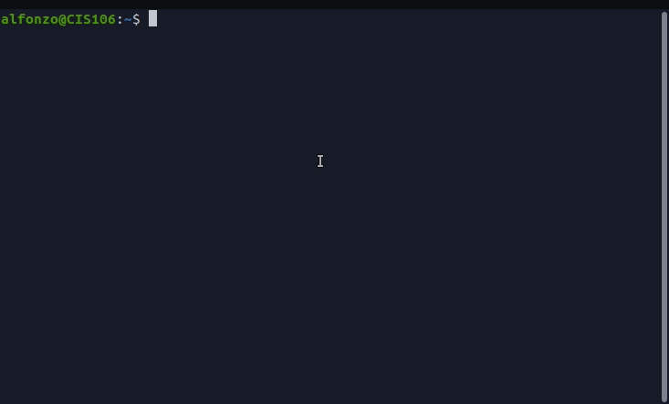

  #### rm 
  * Description : Remove files
  * usage : `rm + file name`
  * Example:
  *  remove a file
     * `rm file.txt `
  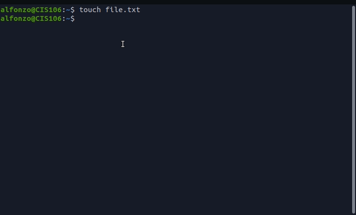    

 #### mv 
 * Description : move and rename directories
 * usage : `mv + source + destination `
 * Example:
 *  to move and rename a file in the same command 
 * `mv Download/BMW.png Documents/BMW.png`
  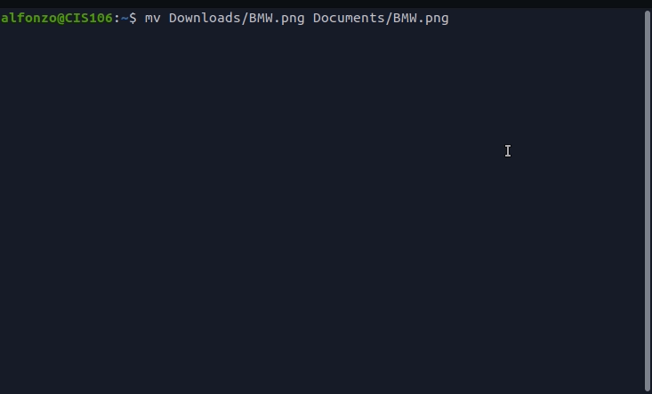
  
  #### cp
  * Description: Copy files/directories from a sourse to a destination
  * usage: `cp + files to copy + destination`
  * Example:
  * to copy a file
  * `cp Documents/BMW.png Picture/`
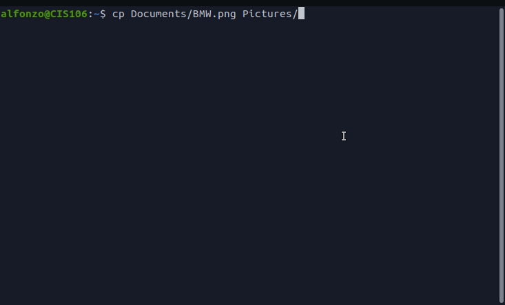