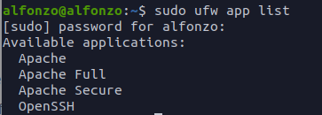
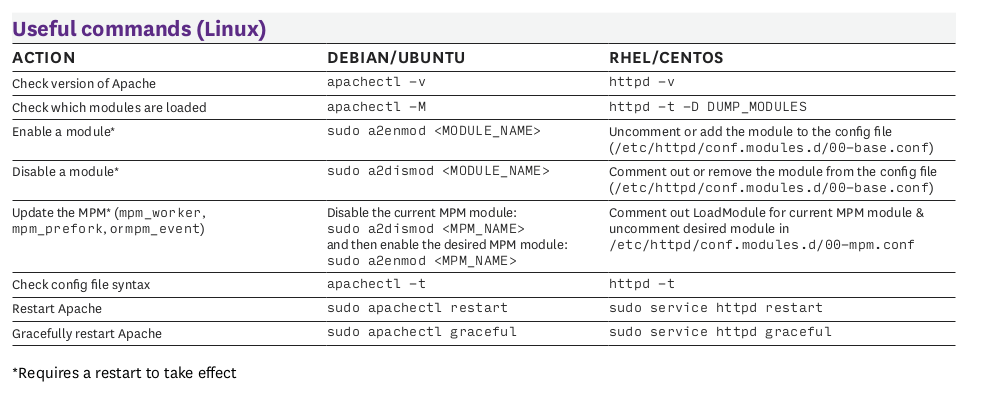
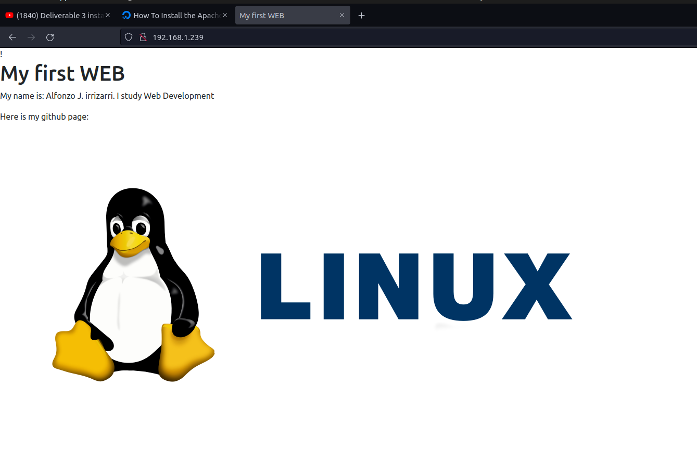

# Web Server
<hr>

**Apache:** Apache is a Web server that accepts directory (HTTP) requests from Internet users and sends them their requested information in the form of files and Web pages.
Much of the software and code on the Internet is made to operate with Apache's capabilities. 

**NGINX:** Nginx (pronounced "Engine-X") is an open source web server that is frequently used as a reverse proxy or HTTP cache. It is free for Linux users. 

**lighttpd:** lighttpd is a web server that runs on UNIX/Linux and Windows.
It is a web server alternative to Apache. It is also known as Lighty. It is intended to be secure, quick, standards-compliant, and versatile, while also being suited for high-speed situations. 

**Set static ip address**

go to your virtual machine setting and change the network adapter to bridge.


**Configuring the Ubuntu Firewall**

After installing Apache, check that your firewall is correctly set.
For handling iptables, Ubuntu comes pre-installed with ufw (Uncomplicated Firewall).If you use the default SSH port, you must enable it before enabling the ufw service to avoid mistakenly blocking yourself from connecting to your server, as ufw by default refuses all incoming traffic.

`ufw permit 22`

Then, using ufw, activate the Apache service.
You can list all application profiles known to the `ufw` service.

`sudo ufw app list`

ufw is aware of three Apache application profiles, as you can see.

According to the result, Apache has three profiles available:
**Apache:**** This profile only allows access to port 80. (normal, unencrypted web traffic)
**Apache Full:** This profile allows access to both port 80 (standard, unencrypted web traffic) and port 443.
**Apache Secure:** This profile only allows access to port 443 (TLS/SSL encrypted traffic). 

**Note:** It is advised that you enable the most restrictive profile that allows the traffic you have set.
We simply need to accept access on port 80 because we haven't yet implemented SSL for our server in this guide: 


`sudo ufw allow 'Apache'`
You can verify the change by typing:

`sudo ufw status`


**How to install the server application you chose**
**Install Apache Web Server**
It is generally a good idea to update your software package listings before installing new applications.

`sudo apt update`

Now that your package list is up to date, we may install Apache on your host system.

`sudo apt install apache2`

After the installation is complete, the Apache httpd daemon should be up and operating.
You can check this yourself by contacting your service manager.
`apache2 service status `

**Basic commands about managing the server application**


**How to start, terminate, and restart a service in Ubuntu**
When operating an Apache web server, you may want to modify its system process in some way.This is possible using the previously mentioned service command, which is a high-level utility tool that handles systemd processes on your Ubuntu machine.First, verify the status of our apache2 service to ensure that Apache is up and functioning.

`apache2 service status`
We can stop apache2 service and check its status again.

`service apache2 start && service apache2 status`

If the service is working but it is experiencing problems, instead of starting and stopping it, we can restart it.

`service apache2 restart`

In case you make some changes to your Apache configuration files and want to apply them without interrupting the active service, you can use reload command instead.

`service apache2 reload`

Apache web server service starts automatically on reboot by default, because usually that is exactly what we want in a web server. You may check if auto boot option is enabled through a systemctl utility directly.

`systemctl is-enabled apache2`

There may be situations when you need to take down your web server for maintenance for a prolonged time, and you don’t want Apache to start after a reboot. In such case you should disable the service with systemctl utility.

`systemctl disable apache2`

After completing your maintenance tasks you can re-enable the service to make Apache start automatically after a reboot.

`systemctl enable apache2`

**How to setup virtual hosts**
When utilizing the Apache web server, you may encapsulate configuration data and host several domains from a single server by using virtual hosts (equivalent to server blocks in Nginx).
We will create a domain named your domain, but you should change it with your own.

On Ubuntu 20.04, Apache is enabled by default and set to serve content from the /var/www/html directory.While this is fine for a single site, it might become cumbersome if you host numerous sites.Rather of changing `/var/www/html`, let us construct a directory structure within `/var/www` for a your domain site, leaving `/var/www/html` as the default directory to be delivered if a client request does not match any other sites.

Make the following directory for your domain: 
`sudo mkdir /var/www/your_domain`

Then, using the `$USER `environment variable, grant ownership to the directory:
`sudo chown -R $USER:$USER /var/www/your_domain`

If you haven't changed the umask value, which determines default file permissions, the permissions of your web roots should be right.
You may use the following command to confirm that your permissions are right and enable the owner to access, write, and execute files while allowing just read and execute permissions to groups and others: 

`sudo chmod -R 755 /var/www/your_domain`

Next, create a sample index.html page using nano or your favorite editor:

`sudo nano /var/www/your_domain/index.html`

Inside, add the following sample HTML:

```
<html>
    <head>
        <title>Welcome to Your_domain!</title>
    </head>
    <body>
        <h1>Success!  The your_domain virtual host is working!</h1>
    </body>
</html>
```
In order for Apache to serve this content, it’s necessary to create a virtual host file with the correct directives. Instead of modifying the default configuration file located at /etc/apache2/sites-available/000-default.conf directly, let’s make a new one at /etc/apache2/sites-available/your_domain.conf:

`sudo nano /etc/apache2/sites-available/your_domain.conf`

Replace the default configuration block with the following, which is adjusted for our new directory and domain name: 
```
<VirtualHost *:80>
    ServerAdmin webmaster@localhost
    ServerName your_domain
    ServerAlias www.your_domain
    DocumentRoot /var/www/your_domain
    ErrorLog ${APACHE_LOG_DIR}/error.log
    CustomLog ${APACHE_LOG_DIR}/access.log combined
</VirtualHost>
```
Let’s enable the file with the a2ensite tool:

    sudo a2ensite your_domain.conf

Disable the default site defined in 000-default.conf:

    sudo a2dissite 000-default.conf

Next, let’s test for configuration errors:

    sudo apache2ctl configtest

You should receive the following output:
```
Output
Syntax OK
```
Restart Apache to implement your changes:

    sudo systemctl restart apache2

Apache should now be serving your domain name. You can test this by navigating to http://your_domain, where you should see something like this:




**Important files and directories**
`index.html`
`/var/www/your_domain/index.html`

**Server log files**

**Sources**
https://www.digitalocean.com/community/tutorials/how-to-install-the-apache-web-server-on-ubuntu-20-04#step-2-adjusting-the-firewall

video tutorial : https://www.youtube.com/watch?v=fwJCyS4dY0E&feature=youtu.be