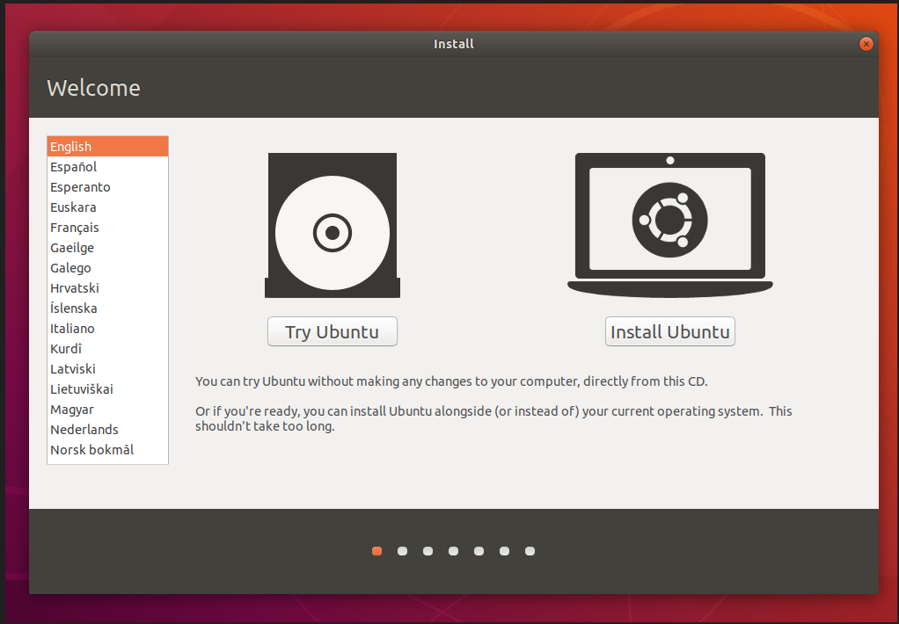
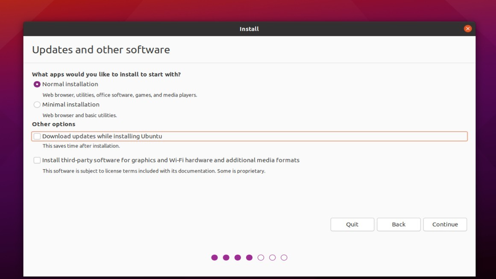
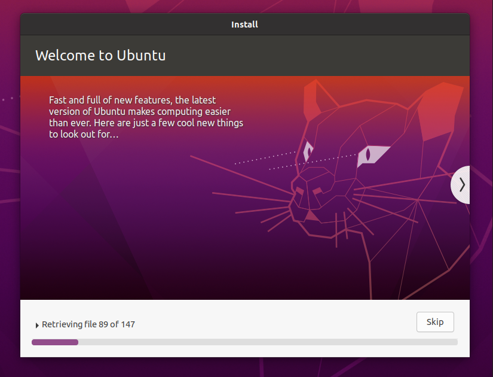
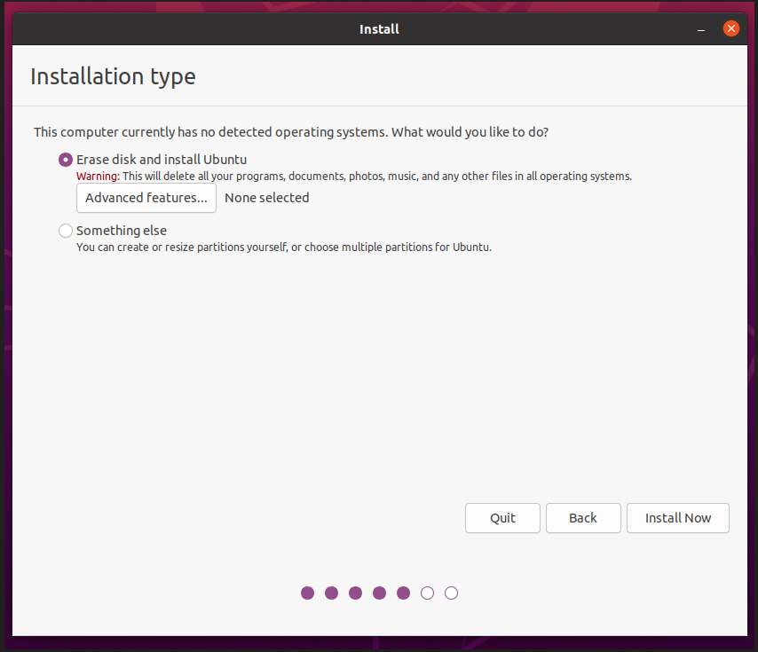
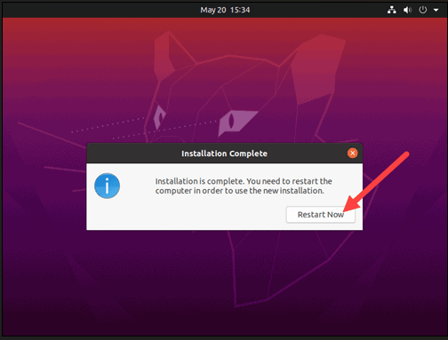

# Week Report 2

## Summary of Presentations

What is virtualization?
Replication of hardware to simulate a virtual machine inside a physical machine

Types of virtualization?

server-side virtualization
client-side virtualization

anything else you find important.
+ allows running multiple OSs on one machine.
+ allows application to be tested before installing them on a host machine.
+ Runs on: windows,linux,macintosh,Solaris

Installing Ubuntu in Virtualbox

Read the presentation What is a raspberry pi. Include the following in your summary:

What is a raspberry pi
The Raspberry Pi is a low cost, credit-card sized computer that plugs into a computer monitor or TV, and uses a standard keyboard and mouse.    

A bulleted list of different models
+   Pi 1 Model B (2012)
+   Pi 1 Model A (2013)
+   Pi 1 Model B+ (2014)
+   Pi 1 Model A+ (2014)
+   Pi 2 Model B (2015)
+   Pi Zero (2015)
+   Pi 3 Model B (2016)
+   Pi Zero W (2017)
+   Pi 3 Model B+ (2018)
+   Pi 3 Model A+ (2019)
+   Pi 4 Model A (2019)
+   Pi 4 Model B (2020)
+   Pi 400 (2021)

Specs of the latest model (Raspberry pi 4 or 400) you can use a screenshot.

Pi 400 	
CPU: 1.8GHz 64-bit quad-core ARMv8
RAM: 4GB
USB: 1 USB 2 port, 3 USB 3 ports
Connectivity: Ethernet, Wi-Fi, Bluetooth
Form factor: Built-in keyboard
$70

Bulleted listed of 5 projects you can do with a raspberry pi. Use the internet to find this information.
+    Google Enabled Magic Mirror.
+    Solar-Powered Pi.
+    Game Console.
+    Remote-Controlled 3D Printer.
+    Language Translator.
+    Satellite Tracking Globe.
+    PC Hardware Stats Monitor.
+    Security Camera.