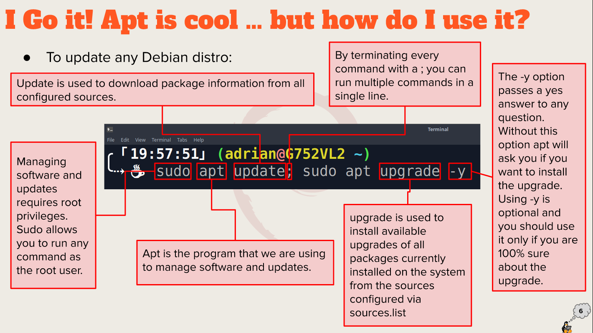

# Week Report 3
## Summary of Presentations
+ package 
+ install / remove programs
+ Add PPA
+ Installing .deb files
+ snap package install/remove
+ use of Flatpak
+ synaptic package

# Exploring Desktop Environments

bulleted list of different desktop environments

+ The LXQT Desktop Environment
+ The Deepin Desktop Environment
+ The Pantheon desktop Environment
+ Thee Raspberry Pi OS Desktop Environment

Definitions for the following terms: GUI, DE

+  **GUI** : A graphical user interface is a set of programs that allows a user to interact with the computer system via icons, windows, and various other visual elements.
+  **DE** : A desktop environment is an implementation of the desktop metaphor made of a bundle of programs running on top of a computer operating system, which shares a common GUI, sometimes described as a graphical shell.

Bulleted list of the common elements of a desktop environment

+ Dock
+ Activities
+ Search Box
+ Calendar and Notification Area
+ Status Menu
+ Applications menu

# The bash Shell

What is a shell?
is a program that provides interactive access to the Linux system.

List different shells
+ Tcsh Shell
+ Csh Shell
+ Ksh Shell
+ Zsh Shell
+ Fish Shell

List some bash shortcuts (no more than 10 and no less than 5)

+ Ctrl + A - go to the start of the command line
+ Ctrl + E - go to the end of the command line
+ Alt + . - use the last word of the previous command
+ Ctrl + P - Previous command in history
+ Ctrl + C - Terminate the command
+ Ctrl + Z - suspend/stop the command
+ Ctrl + Q - allow output to the screen
  
List basic commands and their usage
+ **date** display the current time and date
+ **cal** display a calendar of the current month
+ **df** display the current amount of free space on our disk drives
+ **free** displays the amount of free memory
+ **uname** displays information about your system
+ **clear** clears the screen

# Managing Software

Command for updating ubuntu.
`sudo apt update; sudo apt upgrade -y`

Command for installing software.
`sudo apt install "package name" -y`

Command for removing software.
`sudo apt remove "package name" -y`
Command for searching for software.
`apt search "software name"`

# Definition of the following terms:

**Package** : archives that contain binaries of software,configuration files, and information about dependencies.
**Library** : resuable code that can be used by more than one function or program.
**Repository** : a large collection of software available for download.

