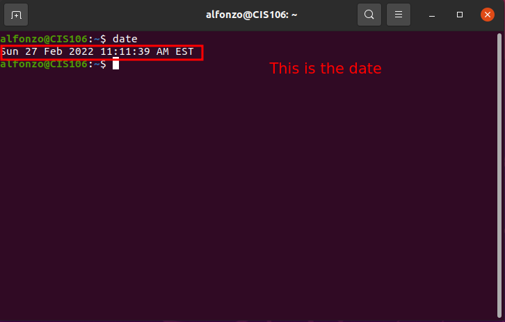
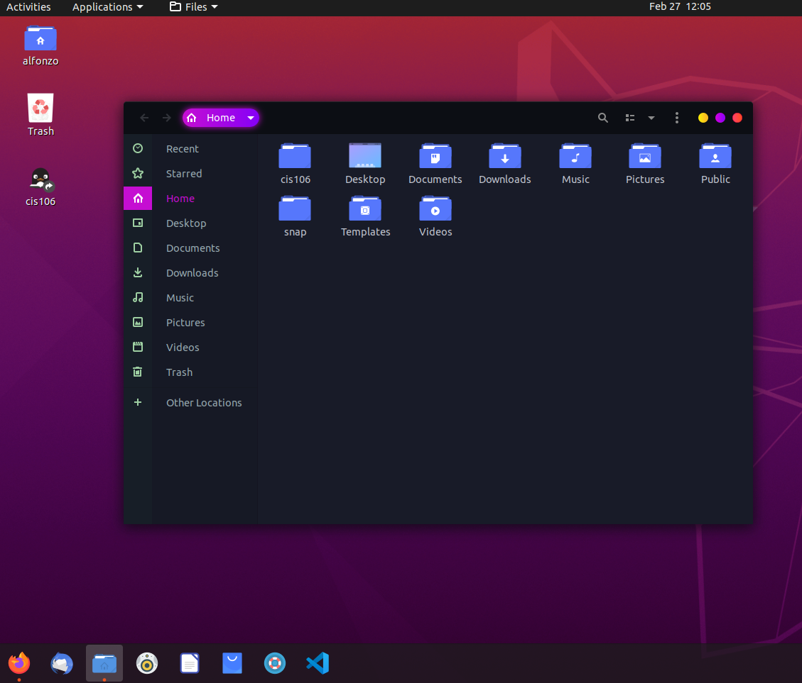
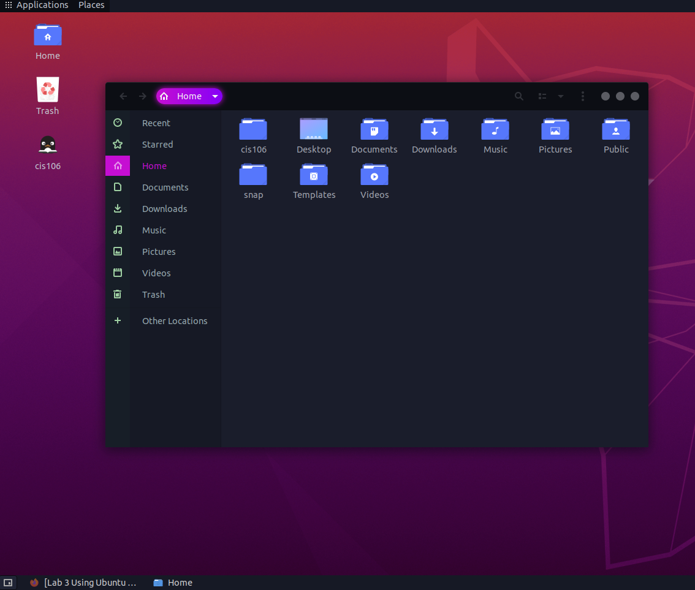

# Lab 3 Using Ubuntu

# Question 1
 

 

# Question 2
 

# Question 3

| Program purpose     | Package Name | Version | Description |
| ------------------- | ------------ | ------- | ----------- |
| Play a tetris game  |quadrapassel|1:3.36.0-1 |tetris game  |
| Play a video file   |bino       |1.6.6-3 |  3D video player|
| Browse the internet |midori      |7.0-2.1    |fast, lightweight graphical web browser|
| Read your email     |geary       |3.36.1-1   |lightweight email client designed for the GNOME desktop|
| Play music          |audacious       |3.10.1 | small and fast audio player which supports lots of formats|

commands Answer:

Question 1: "`sudo apt install quadrapassel bino midori geary audacious -y` "
Question 2: "`sudo apt remove quadrapassel bino midori geary audacious -y` "
Question 3: "`sudo apt install quadrapassel+ bino+ midori- geary- audacious-` "

# Question 4

| command | what it does |
|---------|--------------|
| echo    |  display a line of text|
| fortune | print a random, hopefully interesting, adage|
| cowsay  | configurable speaking/thinking cow|
| lolcat  |  rainbow coloring for text|
| figlet  | display large characters made up of ordinary screen characters|
| toilet  | display large colourful characters|
| rig     | Random Identity Generator|

