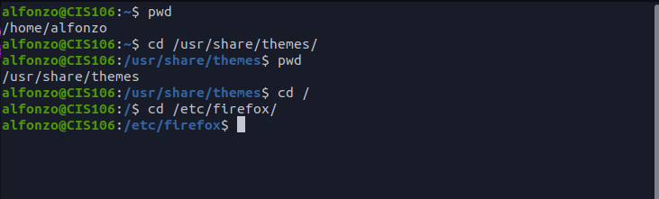
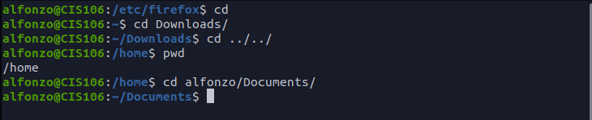
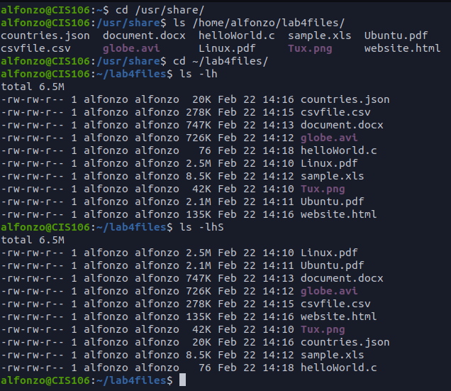
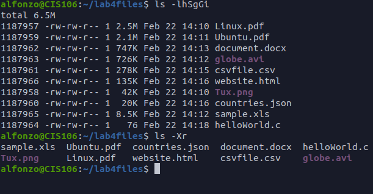
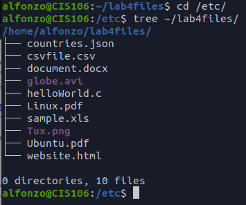
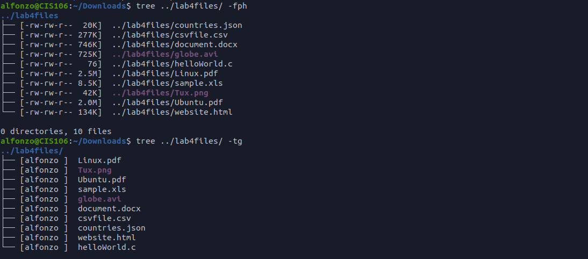
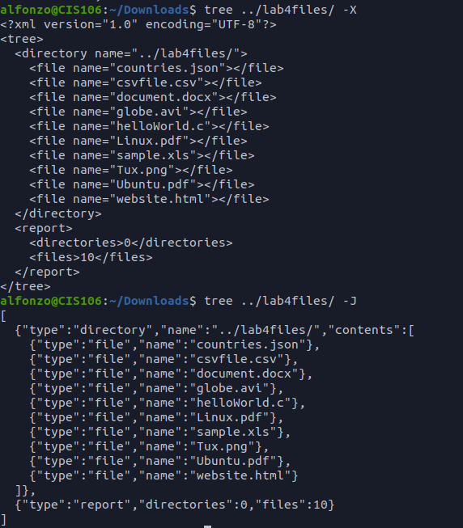
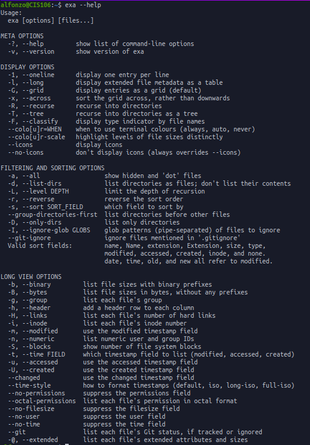
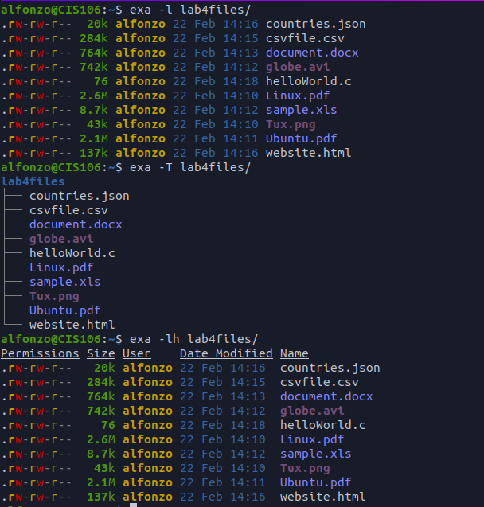

# Lab 4 The Linux file system

## Question 1
### Tablet 1

|Directory |Function
----------|---------
bin       |Essential commands
dev       | Device files
etc       | system configuration files
home      | User Home directories
media     | Mount point for removable media such as DVD and floppy disk
opt       | Add-on software packages
proc      |process information pseudo-filesystem
srv       | Information relating to services that run on the system
usr       | Software not essential for system operation, such as applications

### Tablet 2
Command  |	What it does  |	Syntax  |	Example
---------|----------------|---------|-----------
cd       |Change the current work directory | cd + option | cd Downloads
pwd      |Display the current work directory| pwd | pwd
ls       | is use for listing the content of a given directory | ls | ls -a ~/pictures

## Question 2

## Question 3

## Question 4

## Question 5

