# Lab 7 - Handling Files

## Question 1: cat, tac, head, tail
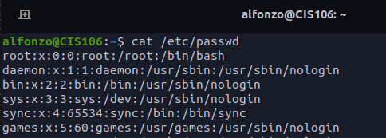
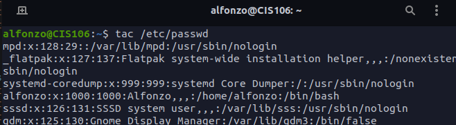

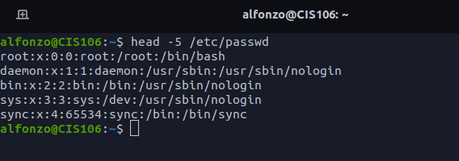
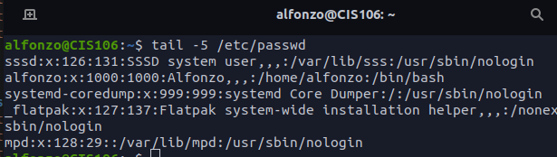

  

## Question 2: cut
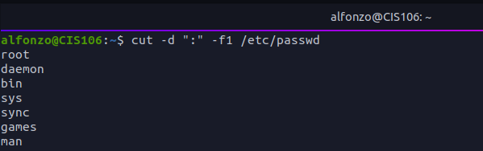
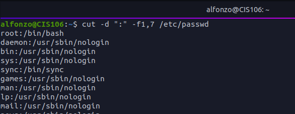
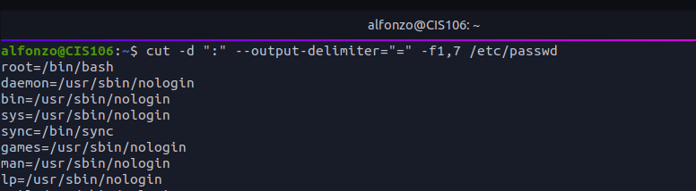
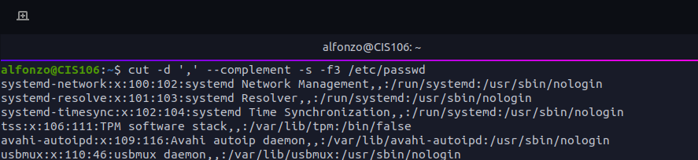

## Question 3 Paste, wc
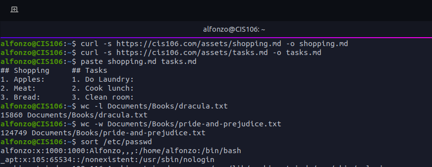

### Question 4 tr, grep
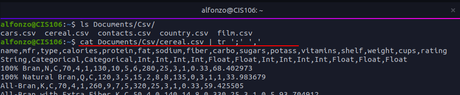
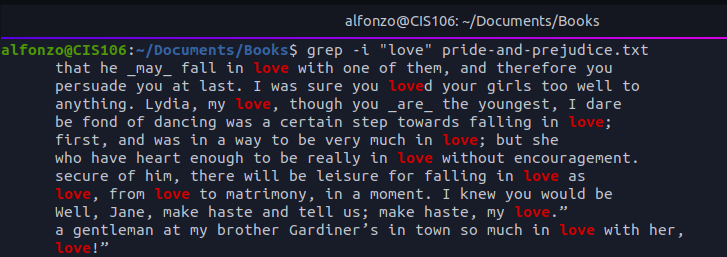
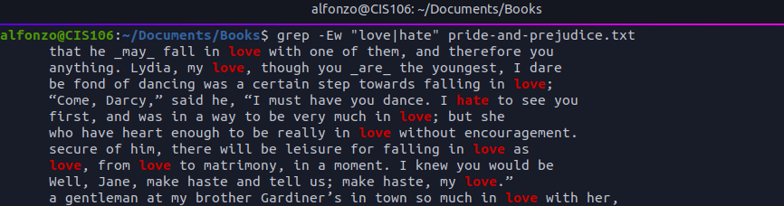
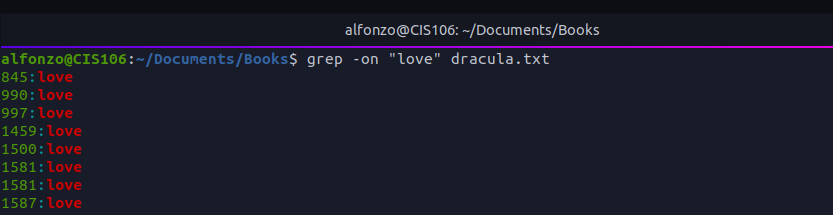

### Question 5 awk and sed
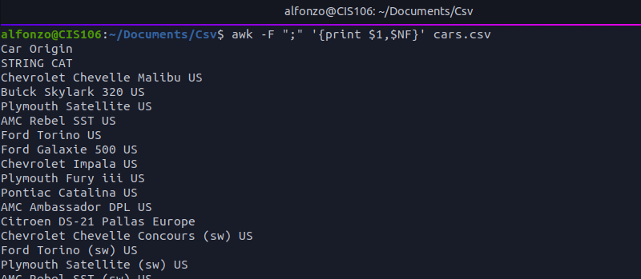
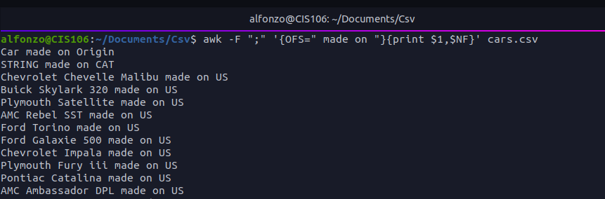
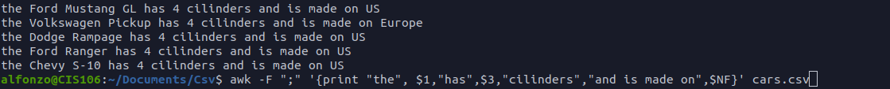
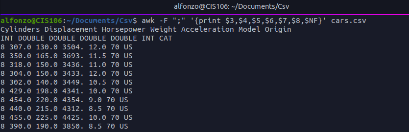
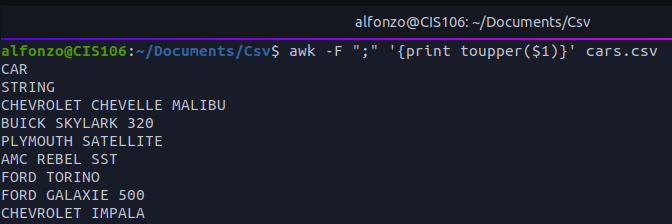
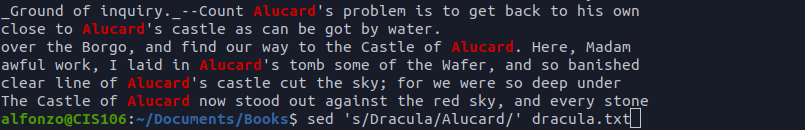
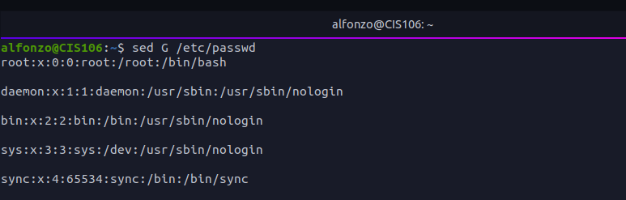
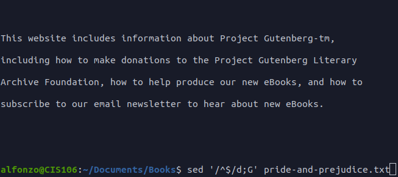

### Question 6 I/O Redirection
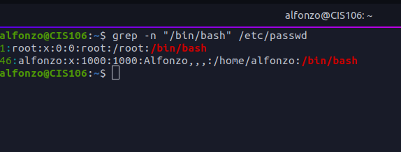
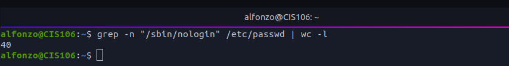
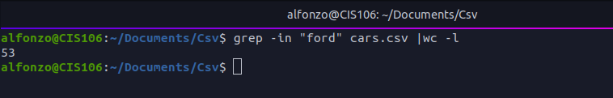
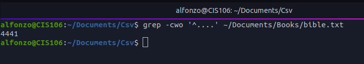

### Challenge Question
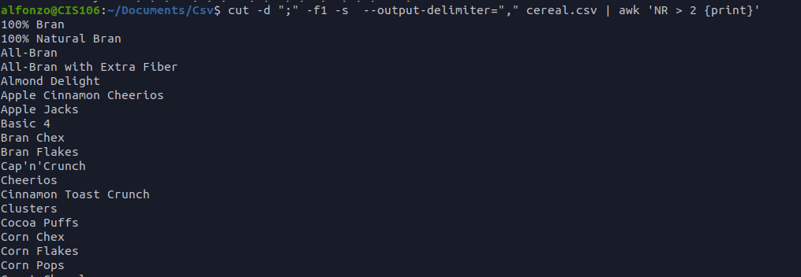
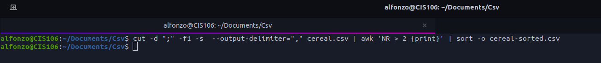
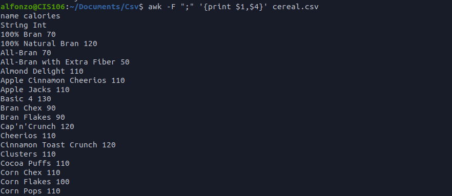
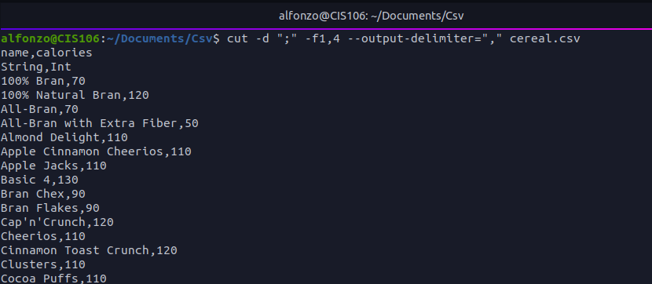