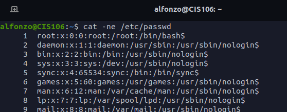

# Lab 7 - Handling Files

## Question 1: cat, tac, head, tail

  

## Question 2: cut

## Question 3 Paste, wc

### Question 4 tr, grep

### Question 5 awk and sed

### Question 6 I/O Redirection

### Challenge Question

